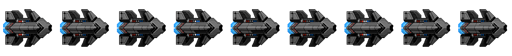

# Vanguard Elite

This module adds the Vanguard Elite (internal name `imperialBigElite`), an upgraded version of the Vanguard.

It can be obtained by either starting a new game and selecting the ship, or buying it in a station 
within a system other than the spawn system for 5000 credits. This module also adds this ship as an ally 
with three squads of three ships roaming around in each non-spawn system.

As of 12/24/2024, the latest source build is required as the module utilizes changes made in a specific
file.

Ship texture by [Jozef Cifre](https://github.com/jozefcifre)

## Version 1.1.0

The module has been updated to fix a bug that prevented the game from loading. The Vanguard Elite has also
been properly added to the `imperial` faction and the `disposition` value is set to 5, so the Empire
(including the Vanguard Elite allies) will now become hostile if harmed enough. It is now available for
purchase as a mercenary in stations in non-spawn systems for 10000 credits.
